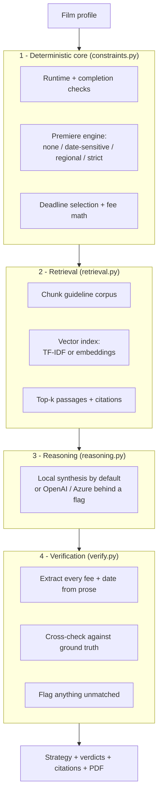

# FestivalScout

[](https://github.com/snehamanjunath14/festivalscout/actions/workflows/ci.yml)

An AI reasoning agent that turns a film's profile into a validated festival
submission strategy — and **runs entirely on your machine with no cloud account,
no API key, and no bill.**

## Architecture

The thesis of this project is one design decision: **eligibility logic runs in
code, never in the model.** A language model is fluent but unreliable at exactly
the things that cost filmmakers money — date arithmetic, fee tiers, and premiere
rules that interact across festivals. So FestivalScout computes every one of
those in plain Python and uses the model only for the nuance code can't express,
with a verification pass over anything the model says.



1. **Deterministic core (`constraints.py`).** Every runtime check, completion-date
   rule, premiere-policy evaluation, deadline calculation, and fee total is
   computed in code. The LLM never decides eligibility, so the numbers in the
   answer are computed, not generated. Premiere policies handled: none,
   date-sensitive (Sundance-style), regional (UK / LA / Texas / U.S. / North
   American), and strict (no prior public release anywhere, e.g. SXSW).
2. **Retrieval (`retrieval.py`).** A local vector index chunks the festival
   guideline corpus, retrieves the top-k passages for a query, and returns each
   with a citation back to the festival's official source URL. Default backend is
   a self-contained TF-IDF index (zero dependencies); an optional
   sentence-transformers backend is one env var away. **This replaced the original
   Azure Foundry IQ knowledge base** so the project reproduces on any clone.
3. **Reasoning (`reasoning.py`).** Weaves the deterministic verdicts and retrieved
   passages into a grounded analysis. Default is deterministic local synthesis
   (no key); set `LLM_PROVIDER=openai` or `azure` to use a generative model.
4. **Verification (`verify.py`).** Extracts every dollar amount and date from the
   model's prose and cross-checks it against the structured dataset. Unmatched
   claims are flagged in the UI instead of silently trusted.

## Does the verification layer actually work? Yes — measured.

`benchmark/verification_bench.py` injects known numeric errors into 200
model-style responses and measures what the verifier catches (seed-fixed, so it
reproduces):

| Error class | Injected | Caught |
|---|---:|---:|
| **Hallucinated fees/dates** (values absent from the dataset) | 207 | **100%** |
| Real value quoted for the wrong festival | 150 | 0% |
| False positives (correct claims wrongly flagged) | — | **0%** |

The verifier catches **every hallucinated number** with **zero false positives**.
It catches none of the "right value, wrong festival" swaps — because it checks
whether a value exists in the ground truth, not which festival it belongs to.
That gap is the whole argument for layer 1: the numbers a filmmaker acts on are
computed in code, not trusted from the model. Full write-up in
[`benchmark/REPORT.md`](benchmark/REPORT.md).

## Coverage

12 festivals spanning shorts and features, verified 2026-06-13 against official
sources:

- **Shorts:** Sundance, Clermont-Ferrand, Palm Springs ShortFest, Slamdance,
  AFI FEST, Tribeca (Shorts)
- **Features:** Tribeca, SXSW, Raindance, Fantastic Fest, Sitges,
  Austin Film Festival

The festival set is data-driven: add more by editing `data/festivals.json`. The
retrieval corpus is rebuilt from that file automatically — no code changes, no
re-upload to any cloud service.

## Run it

```bash
python -m venv .venv
# Windows: .venv\Scripts\activate     Mac/Linux: source .venv/bin/activate
pip install -r requirements.txt
python doctor.py            # confirms the local pipeline works (no key needed)
uvicorn main:app --reload
# open http://127.0.0.1:8000
```

No `.env` is required. To add a generative model, copy `.env.example` to `.env`
and set `LLM_PROVIDER`.

## Test it

```bash
pip install -r requirements-dev.txt
pytest                                   # 68 tests over the deterministic layers
python benchmark/verification_bench.py   # regenerate the verification numbers
```

## Optional upgrades (behind flags, never required)

- **Dense retrieval:** `pip install -r requirements-ml.txt` then
  `RETRIEVAL_BACKEND=dense` for sentence-transformers embeddings.
- **Generative reasoning:** `LLM_PROVIDER=openai` (works with OpenAI, OpenRouter,
  or a local Ollama / LM Studio server) or `LLM_PROVIDER=azure`. If a provider is
  set but unreachable, the app falls back to local synthesis rather than failing.

## Demo

A 2:30 walkthrough script lives in [`DEMO.md`](DEMO.md).

## Stack

- FastAPI + Pydantic backend
- Local TF-IDF retrieval (optional sentence-transformers)
- Single-file HTML/CSS/JS frontend
- reportlab for PDF export

## Known limitations

- Festival dataset covers 12 festivals (verified 2026-06-13); deadlines and fees
  change yearly and should be re-verified at each source URL.
- Some festivals had unannounced or passed deadlines at build time; the app says
  so rather than guessing.
- A few feature festivals don't publish a fixed fee; those show "see source".
- EUR/GBP fees are converted at a fixed indicative rate for budget math only.
- Verification checks numeric claims (fees, dates), not prose claims, and checks
  dataset membership rather than festival-specific correctness (see benchmark).

## Data

No confidential information is used. All festival data comes from public official
guidelines; each entry carries a `source_url` and the set is dated `2026-06-13`.
